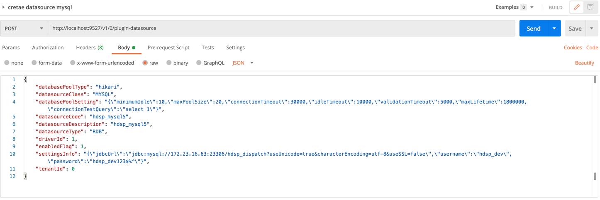

# plugin-driver-parent

### 介绍

数据中台中数据服务模块，需要适配各种数据源，如rdb、elasticsearch、redis、hive、hbase、impala、presto、kudu等各种传统关系型数据库以及大数据查询组件等，进行统一接口查询，进行提供服务给下游，如报表、大屏等。

plugin-driver基于此需求下而开发，采用插件架构，可适配上述各种数据源，可直接返回datasource（这里的datasource是个统称，可代表```javax.sql.DataSource```、```Jedis```等操作具体数据源的对象）给下游服务，下游服务可基于此datasource进行操作，如获取connection进行db的ddl/dml等操作。我们也提供了常用的接口（如table/schema/元数据/分区等），可直接使用。

当然，plugin-driver高度扩展，可根据需求自行开发插件。

### 使用

由于此项目依赖[springboot-plugin-framework](https://github.com/thestyleofme/springboot-plugin-framework-parent.git) 该模块，
故先拉取该项目maven install到本地仓库

```
git clone https://github.com/thestyleofme/springboot-plugin-framework-parent.git
cd springboot-plugin-framework-parent
mvn clean install -pl springboot-plugin-framework
cd springboot-plugin-framework-extension
mvn clean install
```

```
git clone https://github.com/thestyleofme/plugin-driver-parent.git
cd plugin-driver-parent
# 打包全部插件
mvn clean package -DskipTests
# 打包指定插件
cd plugins && mvn clean package -pl driver-mysql5 -am -DskipTests
# swagger
http://localhost:9898/doc.html
```
首先需要先打包，保证plugin下代码被编译，然后执行DriverApplication即可，可访问
swagger地址，查看是否有controller那些接口。

下面的操作可以结合代码进行查看 

> 创建驱动 

```
POST v1/{tanentId}/plugin 
BODY 参照截图
plugin: {
    "pluginId":"driver-mysql5",
    "pluginDescription":"hdspdev_mysql5",
    "pluginVersion":"1.0.0",
    "pluginBigClass":"RDB",
    "pluginSmallClass":"MYSQL"
}

```


> 创建数据源

```
POST /v1/{tanentId}/plugin-datasource
BODY 
{
    "databasePoolType": "hikari",
    "datasourceClass": "MYSQL",
    "databasePoolSetting": "{\"minimumIdle\":10,\"maxPoolSize\":20,\"connectionTimeout\":30000,\"idleTimeout\":10000,\"validationTimeout\":5000,\"maxLifetime\":1800000,\"connectionTestQuery\":\"select 1\"}",
    "datasourceCode": "hdsp_mysql5",
    "datasourceDescription": "hdsp_mysql5",
    "datasourceType": "RDB",
    "driverId": 1,
    "enabledFlag": 1,
    "settingsInfo": "{\"jdbcUrl\":\"jdbc:mysql://172.23.16.63:23306/hdsp_dispatch?useUnicode=true&characterEncoding=utf-8&useSSL=false\",\"username\":\"hdsp_dev\",\"password\":\"hdsp_dev123$%^\"}",
    "tenantId": 0
}
```



接下来就可以统一获取数据源进行相应API调用

```java

@Autowired
private DriverSessionService driverSessionService;

DriverSession driverSession = driverSessionService.getDriverSession(YOUR_TEANANT_ID, YOUR_DATASOURCE_CODE);
List<Map<String, Object>> result = driverSession.executeOneQuery(YOUR_SCHEMA, "SELECT 1 FROM TABLE WHERE ID > 20000");
```

[参照如何使用插件demo示例](docs/plugin-dev.md)

### 其他模块引入

如其他项目依赖多数据源，可添加如下依赖

```
# 先打包到本地
cd plugin-driver-parent
mvn clean install -pl plugin-driver-core -am -DskipTests
```
> pom添加依赖即可
```
<dependency>
    <groupId>com.github.thestyleofme</groupId>
    <artifactId>plugin-driver-core</artifactId>
    <version>${project.version}</version>
</dependency>
```
> 配置文件
```
jasypt:
  encryptor:
    # 加密盐值
    password: ${JASYPT_ENCRYPTOR_PASSWORD:hUyhdphl2gXcBDEH5dy}

plugin:
  run-mode: prod
  plugin-path: dist/plugins
  plugin-config-file-path: dist/pluginConfig
```
### 文档地址
 
[详情](docs/README.md)